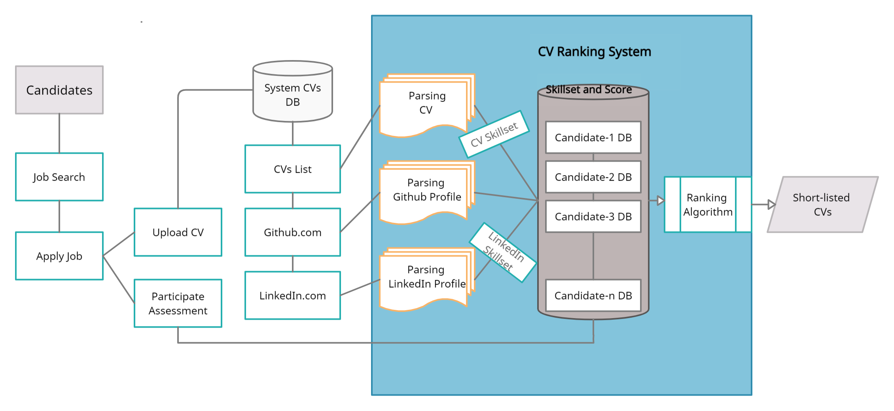

# <p align="left">**Automated Recruitment Process**</p>


Finding the best candidate for a specific job from a recruitment process within the shortest time is a challenge for a company nowadays. Nowadays, there are too many applicants, and it takes too much time and effort to get suitable candidates for a company’s job. The Human Resources team needs more workforce to scrutinize the resumes or CVs of candidates. 

The project aims to develop a more flexible, realistic and expert resume ranker system that ranks the resumes effectively and efficiently and gives the best candidate or candidates. This is a simple Django-based resume ranker website where recruiter users post jobs, candidate-users apply for the job, fill in the required data, and upload resumes. The system ranks the resumes based on the document similarity of the job description and the resumes using the KNN model. It saves human efforts, time, and cost.

# Installation
Requires the following packages:
  - Python 3.9.7 or higher
  - Django 4.0 or higher
  - pip 22.3.1 or higher

It is recommended to use virtual environment packages such as virtualenv. Follow the steps below to setup the project:
  - Clone this repository via  `git clone https://github.com/parvez86/Smart-Recruitment-System`
  - Use this command to install required packages `pip install -r requirements.txt`
  - Crate database and change database settings in `settings.py` according to your database. Install appropriate database connector if need.
    - **Mysql**:
       ```
        DATABASES = {
            'default': {
                'ENGINE': 'django.db.backends.mysql', 
                'NAME': 'DB_NAME',
                'USER': 'DB_USER',
                'PASSWORD': 'DB_PASSWORD',
                'HOST': 'localhost',   # Or an IP Address that your DB is hosted on
                'PORT': '3306',
            }
        }
        ```

  - Generate migration files of the project via terminal: `python manage.py makemigrations`
  - Migrate the project files from terminal: `python manage.py migrate`
  - Create admin user for admin panel from terminal: `python manage.py createsuperuser`. And enter the username, email and password. 
  - Run the project from terminal: `python manage.py runserver`

# System Architecture


The Django project for the automated resume tracking system will utilize a complex system
architecture to ensure efficacy and security. The following technology stack is utilized:
● Django Framework: Our application is developed on the Django web framework. Django's powerful
features and strong ecosystem make a good choice for creating a resume tracking system.
● Front-End: We developed the front-end using web technologies like HTML, CSS, and JavaScript.
This technology stack can deliver a user-friendly experience while keeping the front-end development
straightforward and light weight.
DocuSign Envelope ID: A405DCAC-D13B-4078-AF63-CD5EA6393E63
17
● Back-End: The back-end is powered by Python and Django. Django's built-in features for data
modeling, authentication, and routing tools are beneficial to manage resumes efficiently. The back end
will handle user authentication, resume storage, and retrieval.
● Database: To store resume data securely, we will use the MySQL relational database. MySQL is a
reliable and well-established choice for managing structured data, ensuring data consistency, and
enabling complex queries for efficient resume management.
● Load Balancing: To distribute traffic and ensure high availability, we are implementing AWS Elastic
Load Balancer. It will enhance system performance and prevent service disruptions.
● Monitoring and Logging: CloudWatch, an Amazon Web Services (AWS) service, is integrated to
monitor system performance, log events, and track application metrics. This enables proactive issue
detection and optimization.
The resulting architecture will provide a scalable, high-performance, and secure platform for tracking
and managing resumes. Users will benefit from a seamless experience, with robust authentication, data
security, and integration with external services, making the resume tracking process efficient and
effective.

- **Register/Login:** A user should be an authentic user to post a job or apply for a job.
- **View Job:** A user can browse or search for the job.
- **Apply Job:** An authentic users can apply for a job.  <!-- - **Participate assessment:** -->
- **Upload Resume:** An interested candidate user has to upload their resumes to apply for the desired vacancy.
- **Parsing:** The system parses the candidate resumes and generates the document similarity score of the candidates resumes according to the job description.
- **Ranking:** The system ranks the resumes based on the document similarity scores.

# Ranking Model

- **Data Preprocessing:** Data cleaning, word stemming, and verb lemmatization etc.
- **Basic Requirements:** Check different requirements like CGPA, gender and working experience etc.
- **Requirement Extraction:** 
    - TF-IDF: It calculates a score for each keyword that signifies its importance to the document or resumes.
       ```
       TF(‘keyword’) = number of appeared (‘keyword’)/Total number of (‘keyword’)  
       ```
       ``` 
       IDF(‘keyword’) = log(total number of resumes / total number of the resume with term ‘keywords’)
       It sets IDF log value = 1 for the required resume and 0 for the unwanted.
       ```
- **Generate Document Similarity Score:** Using the KNN (K-Nearest Neighbour) model and the TF-IDF weight of the resumes, the system generates a document similarity score (KNN-score) of each resumes according to the job description.
- **Ranking:** Based on the KNN-scores, the system ranks the resumes and shortlists them.

<!-- # Project Features

| Home Page   | Job List| Single Job Details  |
|:---------------:  |:-----------:|:-------:|
|![home_page]|![job_list]|![single_job]  |


| Apply Job   | Shortlisted Candidates  |SignUp Page|
|:-------------------:|:-----------------------:|:------------:|
|![apply_job]|![ranking]|![signup_page]|


[home_page]: https://github.com/parvez86/Smart-Recruitment-System/blob/main/ProjectPic/3_1_homepage.png
[job_list]: https://github.com/parvez86/Smart-Recruitment-System/blob/main/ProjectPic/5_joblisting_page.png
[single_job]: https://github.com/parvez86/Smart-Recruitment-System/blob/main/ProjectPic/8_single_job_details.png
[apply_job]: https://github.com/parvez86/Smart-Recruitment-System/blob/main/ProjectPic/9_apply_job_page.png
[ranking]: https://github.com/parvez86/Smart-Recruitment-System/blob/main/ProjectPic/10_rank_page.png
[signup_page]:  https://github.com/parvez86/Smart-Recruitment-System/blob/main/ProjectPic/11_signup_page.png -->
